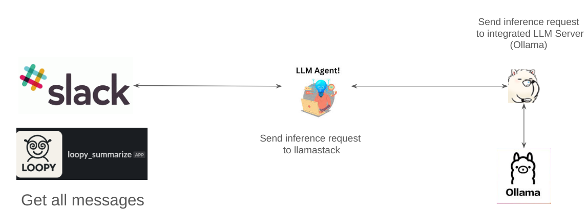
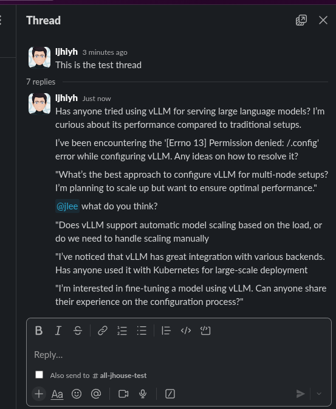
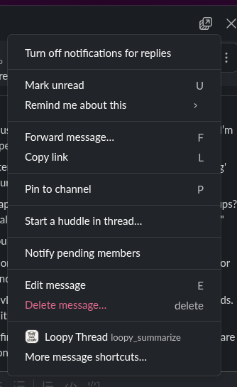
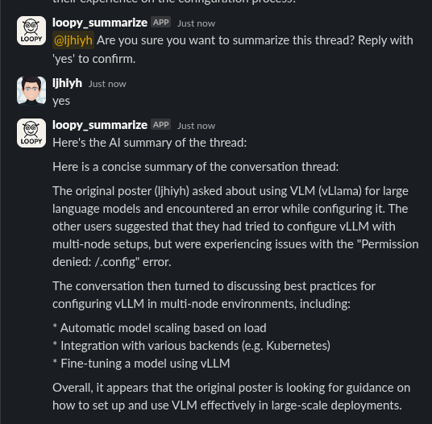

# 📘 Tutorial: Build a Slackbot with LLM Agent using Ollama and Llama Stack

Slack bot will gather all messages from a thread and send it to LLM Agent. LLM agent only handle this case so it does not do like real agent for now but if we can add more feature it will work agent for you. At the moment, it will made right format to request llamastack to get summary of that messages. llamastack already integrated with Ollama so after it got the request, it will pass to Ollama. Then the result will be returned to the slack.




## Table of Contents

**1.Introduction**

- Overview of what we’re building
- High-level architecture
- Folder structure

  ```bash
  .
  ├── slack_bot/             # Slack bot codebase
  └── summary_llm_agent/     # LLM agent logic for summarizing threads
  ```

*Part 1: Create a Slack Bot*

- Setting up a Slack App
- Enabling the message shortcut for threads
- Gathering thread messages using Slack API
- **Follow up [README.md](slack-summary-using-llama-stack/slack_bot/README.md)**


*Part 2: Deploy Ollama Locally*
*Part 3: Set Up Llama Stack*
- Install and run Ollama
- Load the desired LLM model (e.g., LLaMA 3, Mistral)
- Connect Llama Stack with your local Ollama
- API endpoints and configuration
- **Follow Up [README.md](../llama-stack/quick_start/README.md)**

*Part 4: Create the LLM Agent*
- Design the summarization agent
- Use LlamaIndex or LangChain to manage prompts and tools
- Load thread content and return concise summaries
- **Follow Up [README.md](../summary_llm_agent/quick_start/README.md)**

*Part 5: Integrate Everything*
- Connect Slack Bot to the LLM agent
- Send thread messages from slack_bot to summary_llm_agent
- Return summary back to the Slack thread


[full-script.md](./full-scripts.md)
## Example

- Go to slack thread 
  

- Click "Loopy Thread"
  

- It showes summary
    