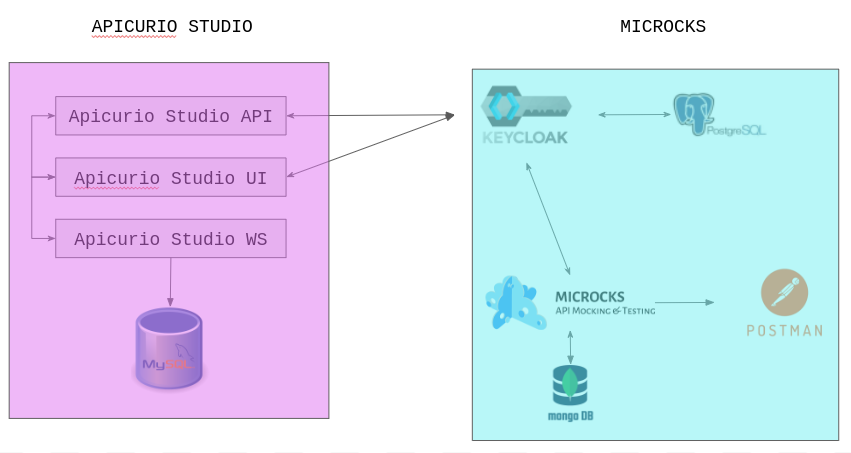

# API Designer Setup

## Architecture

## Setup steps
1. Update [env.sh](./env.sh)
    ~~~
    # Customize Part
    export PROJECT_NAME=apicurio
    export MICROCKS_CR_NAME=microks
    export DOMAIN=apps.isvdemoprd.tqxf.p1.openshiftapps.com
    export STORAGE_CLASS_NAME=nfs
    export MICROCKS_KC_USER=jlee
    export MICROCKS_KC_PW=1234
    ~~~
2. Login to OpenShift or Kubernetes
    ~~~
    oc login 
    ~~~
3. Install Microcks using [install_microcks.sh](./install_microcks.sh)
    ~~~
    ./install_microck.sh
    ~~~
4. Install Apicurio Studio using [install_apicurio.sh](./install_apicurio.sh)
    ~~~
    ./install_apicurio.sh
    ~~~
   

## Access Information
* UI URLs
    ~~~
    . ./env.sh
    echo "Apicurio Studio UI URL: ${APICURIO_URL}"
    echo "Micriocks UI URL: ${MICROCKS_URL}"
    ~~~

* Get username/password for Keycloack
    ~~~
    echo "username:  $(oc get secret ${MICROCKS_CR_NAME}-keycloak-admin -ojsonpath='{.data.username}'|base64 -d)"
    echo "password:  $(oc get secret ${MICROCKS_CR_NAME}-keycloak-admin -ojsonpath='{.data.password}'|base64 -d)"
    ~~~

