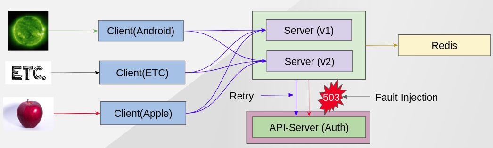
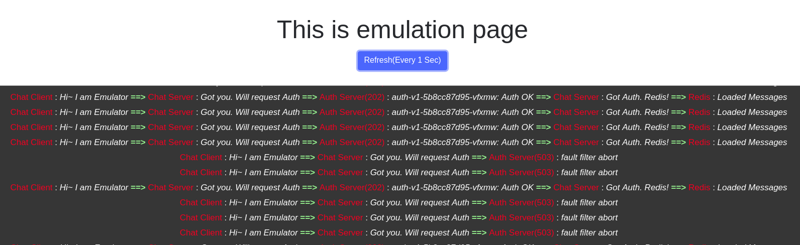
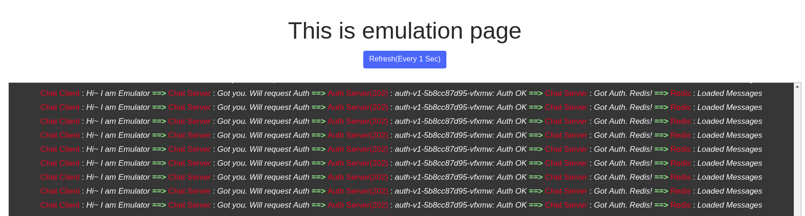

Fault Inject && Retry 
--------------------

ISTIO provide a way to inject fault to a service and also can make a retry when it failed.

This demo show how to inject fault to a service and how to apply `retry ISTIO policy`. At first, you can see 503 errors but after applying `Retry ISTIO policy`, the fault will be gone.


### Situation Architecture ###


### Clean Up Previous Demo ###

```
oc delete virtualservice auth

oc rsh $(oc get pod|grep auth|head -n 1|awk '{print $1}')  
curl http://localhost:8080/longtask/off
exit
```

### Script ###
- Inject Error to service
```
oc apply -f  scripts/istio/8-0.vs-auth-fault-503.yaml
```

- Check browser
```
${CHAT_CLIENT_HOSTNAME}/emulate
```



- Apply Retry ISITO Policy
```
oc delete virtualservice auth-fault

## It may have some bugs because if I don't change the creation order, the fault-inject keep happening.
oc apply -f  scripts/istio/8-1.vs-initial-server-retry.yaml
oc apply -f  scripts/istio/8-0.vs-auth-fault-503.yaml
```

### Result ###


Next - link:./11.circuit_breaker.adoc[Circuit Breaker]
