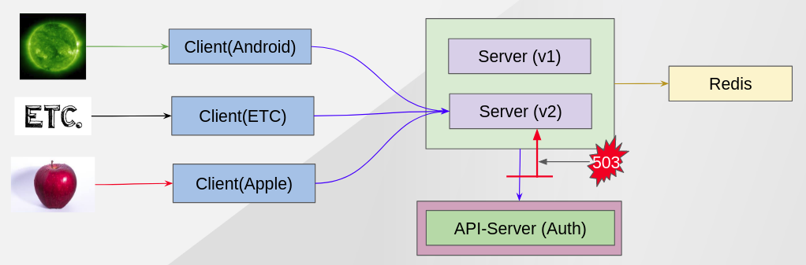

Circuit Breaker
--------------

One of strong ISTIO features is Circuit Breaker that is famous because of NetflixOSS. NetflixOSS support Circuit Breaker for Java applications but ISTIO support all languages without changing codes.

This demo show that if there are many requests to Auth application more than what this application can handle, ISTIO will cut it off to prevent more serious problems.


### Situation Architecture ###



### Clean Up Previous Demo ###
```
oc delete virtualservice auth-fault auth-retry
```

### Install Siege ###
link:./install_siege.adoc[Siege Compile Steps]


### Script ###
- Put load with siege program
```
siege -r 2 -c 20 http://${CHAT_SERVER_HOSTNAME}/emulate?id=abc
** SIEGE 4.0.4
** Preparing 20 concurrent users for battle.
The server is now under siege...
HTTP/1.1 202     0.07 secs:     276 bytes ==> GET  /emulate?id=abc
HTTP/1.1 202     0.07 secs:     276 bytes ==> GET  /emulate?id=abc
HTTP/1.1 202     0.07 secs:     276 bytes ==> GET  /emulate?id=abc
HTTP/1.1 202     0.07 secs:     276 bytes ==> GET  /emulate?id=abc
HTTP/1.1 202     0.07 secs:     276 bytes ==> GET  /emulate?id=abc
...

Transactions:		          40 hits
Availability:		      100.00 %
Elapsed time:		        0.13 secs
Data transferred:	        0.01 MB
Response time:		        0.06 secs
Transaction rate:	      307.69 trans/sec
Throughput:		        0.08 MB/sec
Concurrency:		       19.23
Successful transactions:          40
Failed transactions:	           0
Longest transaction:	        0.08
Shortest transaction:	        0.04

```
Every requests are finished in 0.07 secs without errors because it returns immediately due to duplicated userId "abc"


- Apply Circuit Breaker ISTIO Policy
This ISTIO Policy cut requests when there are more than 1 request concurrently.

```
oc apply -f scripts/istio/9-0.destinationRule-auth-cb-policy-max-connection.yaml
```


- Put load with siege program
```
siege -r 2 -c 20 http://${CHAT_SERVER_HOSTNAME}/emulate?id=abc
** SIEGE 4.0.4
** Preparing 20 concurrent users for battle.
The server is now under siege...
HTTP/1.1 503     0.04 secs:     209 bytes ==> GET  /emulate?id=abc
HTTP/1.1 202     0.04 secs:     276 bytes ==> GET  /emulate?id=abc
HTTP/1.1 202     0.04 secs:     276 bytes ==> GET  /emulate?id=abc
HTTP/1.1 202     0.05 secs:     276 bytes ==> GET  /emulate?id=abc
HTTP/1.1 503     0.05 secs:     209 bytes ==> GET  /emulate?id=abc
HTTP/1.1 503     0.05 secs:     209 bytes ==> GET  /emulate?id=abc
HTTP/1.1 503     0.05 secs:     209 bytes ==> GET  /emulate?id=abc
HTTP/1.1 503     0.05 secs:     209 bytes ==> GET  /emulate?id=abc
HTTP/1.1 503     0.05 secs:     209 bytes ==> GET  /emulate?id=abc
HTTP/1.1 503     0.06 secs:     209 bytes ==> GET  /emulate?id=abc
HTTP/1.1 503     0.06 secs:     209 bytes ==> GET  /emulate?id=abc
...

Transactions:		          23 hits
Availability:		       57.50 %
Elapsed time:		        0.12 secs
Data transferred:	        0.01 MB
Response time:		        0.10 secs
Transaction rate:	      191.67 trans/sec
Throughput:		        0.08 MB/sec
Concurrency:		       18.42
Successful transactions:          23
Failed transactions:	          17
Longest transaction:	        0.10
Shortest transaction:	        0.02
```
Almost half of requests return 503 because of ISTIO Policy.


- Increase http1MaxPendingRequests from 1 to 20.
```
oc apply -f scripts/istio/9-1.destinationRule-auth-cb-policy-pending.yaml
```

- Put load with siege program
```
siege -r 2 -c 20 http://${CHAT_SERVER_HOSTNAME}/emulate?id=abc
** SIEGE 4.0.4
** Preparing 20 concurrent users for battle.
The server is now under siege...
HTTP/1.1 202     0.04 secs:     276 bytes ==> GET  /emulate?id=abc
HTTP/1.1 202     0.05 secs:     276 bytes ==> GET  /emulate?id=abc
HTTP/1.1 202     0.05 secs:     276 bytes ==> GET  /emulate?id=abc
HTTP/1.1 202     0.05 secs:     276 bytes ==> GET  /emulate?id=abc
HTTP/1.1 202     0.05 secs:     276 bytes ==> GET  /emulate?id=abc
HTTP/1.1 202     0.05 secs:     276 bytes ==> GET  /emulate?id=abc
HTTP/1.1 202     0.06 secs:     276 bytes ==> GET  /emulate?id=abc
HTTP/1.1 202     0.06 secs:     276 bytes ==> GET  /emulate?id=abc
HTTP/1.1 202     0.06 secs:     276 bytes ==> GET  /emulate?id=abc
HTTP/1.1 202     0.06 secs:     276 bytes ==> GET  /emulate?id=abc
HTTP/1.1 202     0.06 secs:     276 bytes ==> GET  /emulate?id=abc
...

Transactions:		          40 hits
Availability:		      100.00 %
Elapsed time:		        0.15 secs
Data transferred:	        0.01 MB
Response time:		        0.05 secs
Transaction rate:	      333.33 trans/sec
Throughput:		        0.09 MB/sec
Concurrency:		       17.17
Successful transactions:          40
Failed transactions:	           0
Longest transaction:	        0.09
Shortest transaction:	        0.03
```
Now, we don't get any 503 errors but it is slower than before because some requests were in queue.
