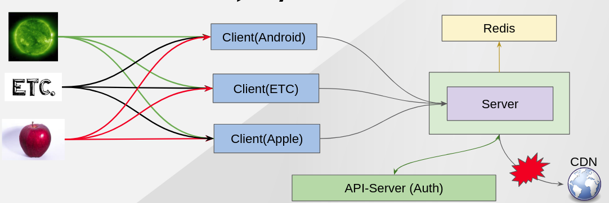
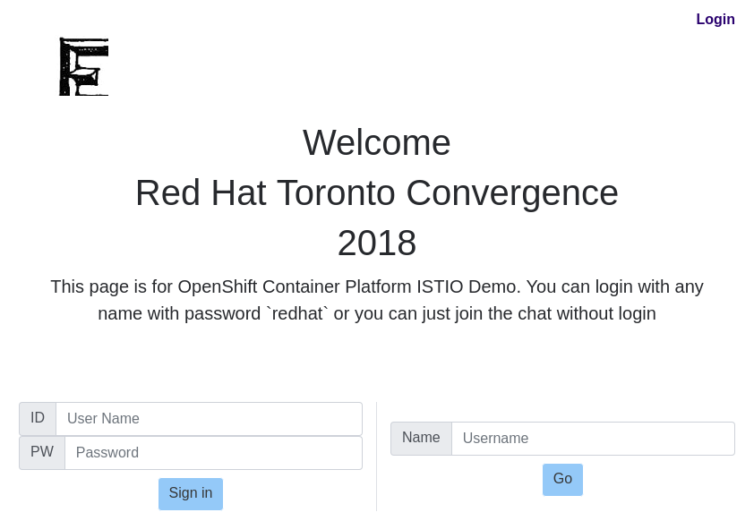

Deploy Base Applications for Demo
---------------------------------

### Description ###

This Demo use 4 applications (Chat Client<apple,android,v1)/Chat Server/Redis/Auth application).

This bash script(2.deploy_base_applications.sh) will deploy 6 pods and at first only v1 chat client is accessible even though there are 3 clients. 
Redis is for storing messages and Auth application to check authorization but it is a fake app so it is always returning 'OK' unless we don't enable longtask and misbehave. 
Lastly, there is external resource from common.redhat.com as a CDN server but it does not work now because all egress traffics are blocked by istio.

### Architecture ###




### Script ###

```
$ ./2.deploy-applications.sh
``` 

### Result ###



Next - link:./4.distribute_users_based_on_device.adoc[Demo 2 - Distribute users based on device agent]
