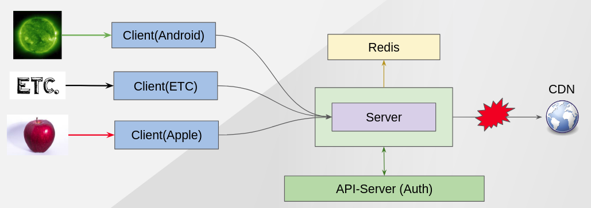
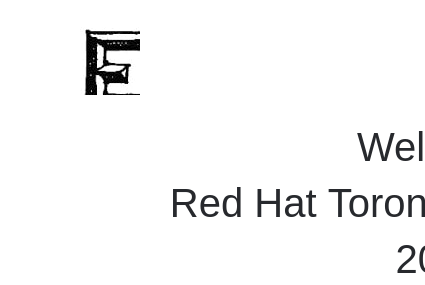

Distribute Users Based on Device Agent
--------------------------------------

### Description ###

This demo shows how istio can detect header *agent* and route packets to right client. 
There are 3 clients for android,apple and v1 which is the default. By default, user can see apple,android and etc logo on the left top side from client application and it will be changed by round robin manner.
However, if we apply istio policy(virtualService/destination), it will go to right client based on device agent.

### What We Want ###




### Before applying ISTIO policy ###
You can see apple/android/etc logo on left top in round robin manner.

 
 



### Applying ISTIO Policy ###
```
# Add 3 differnt clients
oc apply -f scripts/istio/2-0.destinationRule-chat-client-android-apple.yaml  

# Detect device agent and route it to the right client.
cat scripts/istio/2-1.vs-client-apple-android.yaml |sed "s/%CHAT_CLIENT_HOSTNAME%/${CHAT_CLIENT_HOSTNAME}/g" |oc apply -f -

```

*Tip.*

If you already change CHAT_CLIENT_HOSTNAME from scripts/istio/2-1.vs-client-apple-android.yaml, you can just apply it.
```
oc apply -f  scripts/istio/2-1.vs-client-apple-android.yaml 
```

### Result ###
Refresh your browser then you only can see specific logo depending on your device agent.


Next - link:./5.allow_egress.adoc[Demo 3 - Allow Egress]

