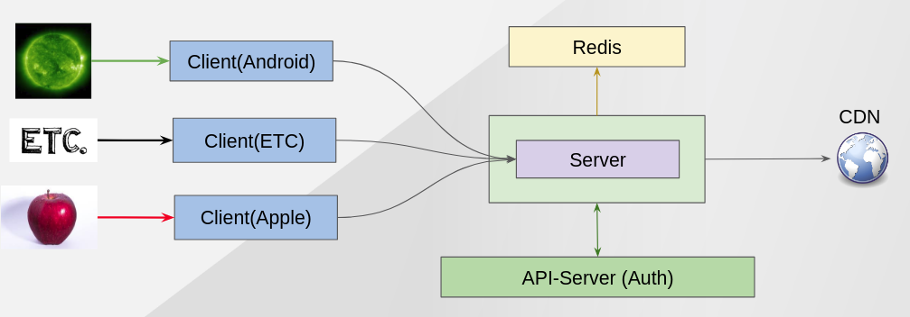
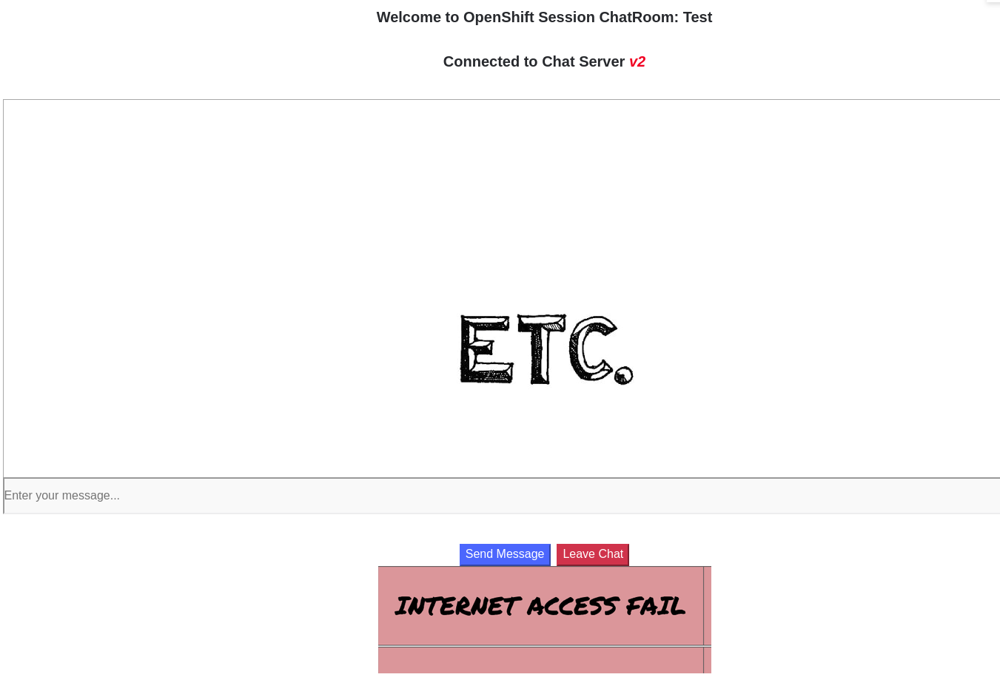
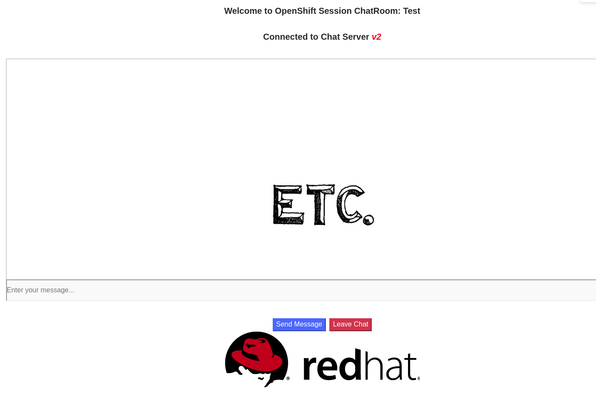

Allow Egress
------------

### Description ###

By default, ISTIO block all egress access from OpenShift. If you want to access any sites out of OpenShift, you need to allow it.

This demo has CDN server(common.redhat.com), which is not actually real CDN. From Chat Server, it tries to get an Red Hat logo from the CDN but Chat Server is running in OpenShift so it is blocked.

That's why you can see "INTERNET ACCESS FAIL" logo after you login. However, after you allow the egress, you can see Red Hat logo properly.


### What We Want ###




### Before applying ISTIO Policy ###


### Applying ISTIO Policy ###
```
oc apply -f scripts/istio/3-0.serviceEntry-egress.yaml  
```

### Result ###


Next - link:./6.canary_deployment_chat_server.adoc[Demo 4 - Canary Deployment]
