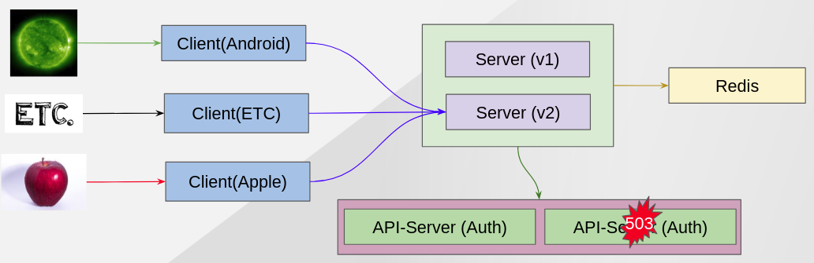
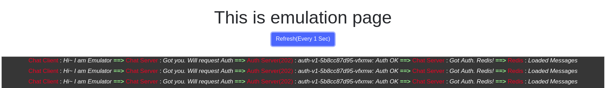
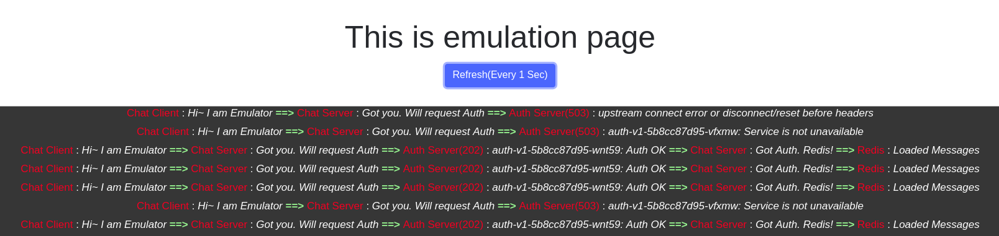
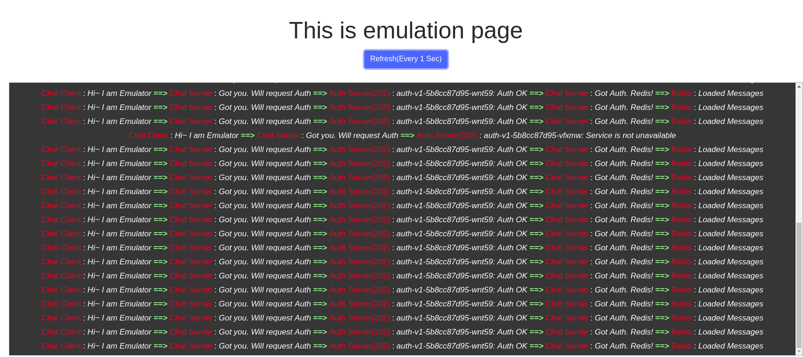

Pod Ejection 
------------

ISTIO has a feature to exclude one of pods that has some errors.

This demo show it ejects problematic pod which return 503 error code from pool.


### Situation Architecture ###




### Clean Up Previous Demo ###

Scale down Chat Server v2 to 1 and make all requests to go to v2 only.
```
oc scale -n chat deployment chat-server-v2 --replicas=1
oc apply -n chat -f scripts/istio/4-0.destinationRule-chat-server-v1-v2-roundrobin.yaml
cat scripts/istio/4-3.vs-server-v1-v2-0-100.yaml | sed "s/%CHAT_SERVER_HOSTNAME%/${CHAT_SERVER_HOSTNAME}/g" | oc apply -f -
```


### Go to browser ###

This emulate endpoint show full flow from client to server/auth/redis.
```
${CHAT_CLIENT_HOSTNAME}/emulate
```



### Script ###

- Scale out Auth application from 1 to 2
```
oc scale -n chat deployment auth-v1 --replicas=2
```

- Make error happen from one of auth application pod
```
oc rsh $(oc get pod|grep auth|head -n 1|awk '{print $1}')  
curl localhost:8080/misbehave
exit
```

- Check browser "emulate" (Click blue button)



Now you can see, sometimes, Auth application return 503 


### Applying ISTIO Policy ###
```
oc apply -n chat -f scripts/istio/6-0.destinationRule-auth-cb-policy-pool-eject.yaml 
```

- Check browser "emulate" (Click blue button)



Now you can see, when Auth application return 503, the pod is excluded from service. After 20secs, ISTIO include the problematic pod then get error code again. Therefore, ISTIO exclude the pod again then we don't see error for 20secs.


Next - link:./9.timeout.adoc[Demo 7 - Timeout]

