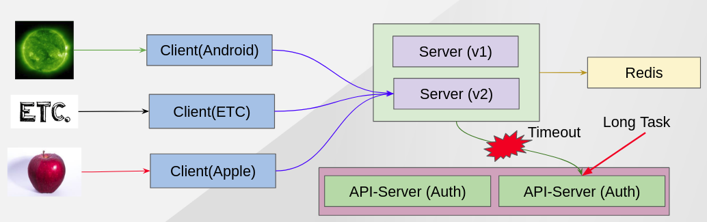

ISTIO TIMEOUT
-------------

ISTIO has a feature to cut off requests that takes more than what we expected.

This demo show that all requests that take more than 1 sec will be cut by ISTIO.


### Situation Architecture ###


### Clean Up Previous Demo ###

Scale down Auth application to 1 and recover the misbehave of Auth application.
```
oc scale -n chat deployment auth-v1 --replicas=1
oc rsh $(oc get pod|grep auth|head -n 1|awk '{print $1}')  
curl localhost:8080/misbehave/off
exit
oc delete destinationrule auth-cb-policy
```


### Before Applying ISTIO Policy ###

- Check how long it takes to get return from Chat Server
```
time curl http://${CHAT_SERVER_HOSTNAME}/login?id=test
{"chat_members":["test"],"status":"OK"}
real	0m0.225s
user	0m0.007s
sys	0m0.006s

```
It is pretty fast under 0.3 secs.

- Make longtask happen in Auth application
```
oc rsh $(oc get pod|grep auth|head -n 1|awk '{print $1}')  
curl http://localhost:8080/longtask
exit
```
- Check how much slower then before
```
time curl http://${CHAT_SERVER_HOSTNAME}/login?id=test
{"chat_members":["test"],"status":"OK"}
real	0m5.293s
user	0m0.006s
sys	0m0.005s
```
Now, it takes more than 5 secs. It is not good for service application so we want to cut it off when the requests takes more than 1secs.


### After Applying ISTIO Policy ###
```
oc apply -n chat -f scripts/istio/7-0.vs-initial-auth-timeout.yaml
```

- Check how long it takes and what ISTIO do and what http code return.
```
for i in {10..100}; do time curl http://${CHAT_SERVER_HOSTNAME}/login?id=test${i}; done
upstream request timeout
real	0m1.211s
user	0m0.006s
sys	0m0.005s
upstream request timeout
real	0m1.223s
user	0m0.003s
sys	0m0.010s
```
As you can see, it cuts them off by ISTIO and retrun 504 error code(`GATEWAY TIMEOUT`)because it takes more than 1 sec.

Next - link:./10.fault_inject_and_retry.adoc[Fault Inject && Retry]

