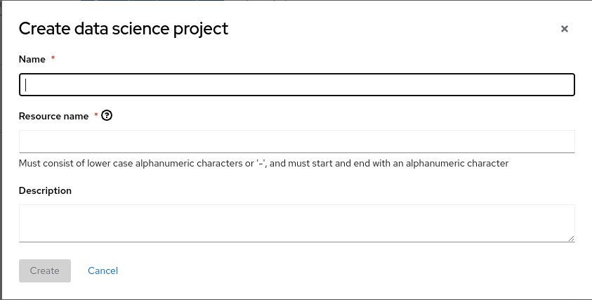
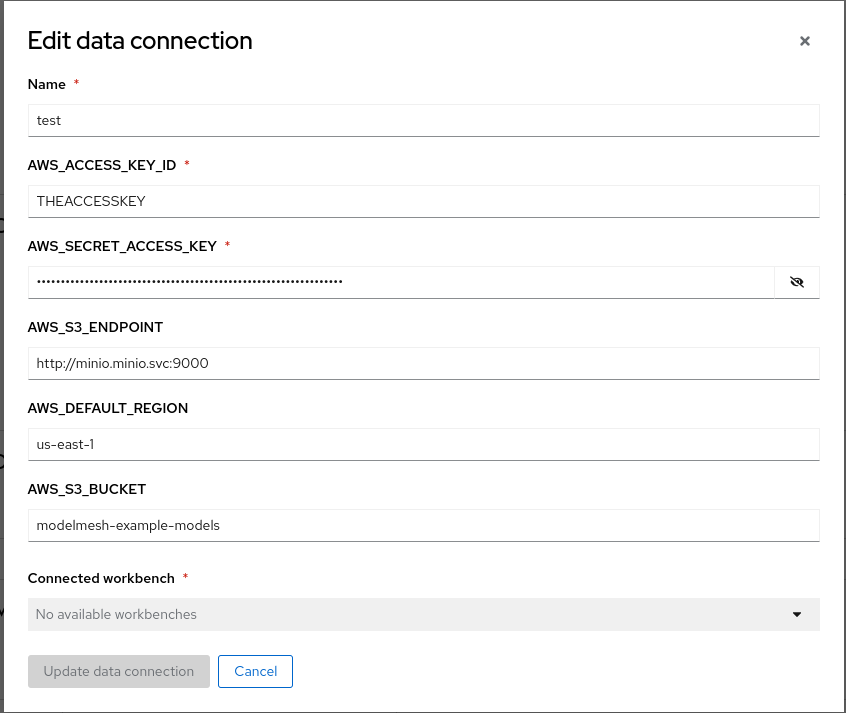
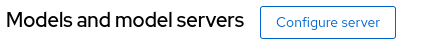
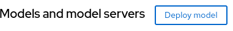
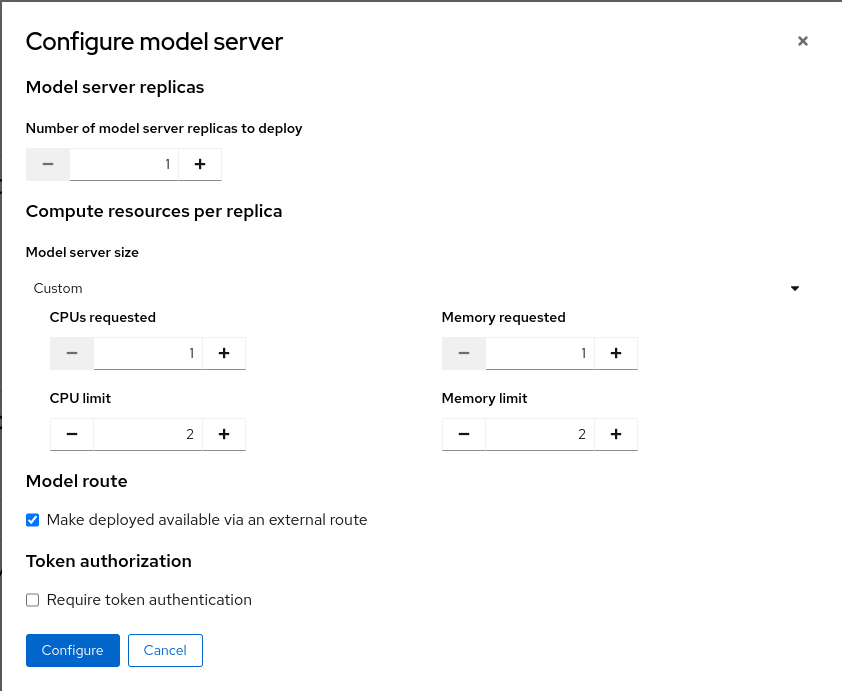

# Upstream(ODH) Model mesh

## Installation
**Setup model using Minio**
~~~
./1.deploy-minio.sh
~~~

**Deploy Model Mesh Only**
~~~
./2.deploy-modelmesh.sh
~~~

**Deploy a test model with openvino ServingRuntime**
~~~
./3.model-test.sh
~~~
**Test**
~~~
curl 
~~~

## RHODS Model Mesh Ovms ServingRuntime
**Create a Model Mesh Ovms ServingRuntime has enable-route/enable-auth annotation**
~~~
oc delete isvc example-onnx-mnist

cat openvino-serving-runtime.yaml
..
  annotations:
    enable-route: "true"
    enable-auth: "false"
..    
oc apply -f openvino-serving-runtime.yaml
~~~
**Deploy a test model with ModelMesh ovms ServingRuntime**
~~~
oc apply -f ./openvino-inference-service.yaml 
~~~

*You can see created route and oauth-proxy container in a pod*

**Test**
~~~
export HOST_NAME=$(oc get route example-onnx-mnist -n opendatahub-mm -ojsonpath='{.spec.host}')
export HOST_PATH=$(oc get route example-onnx-mnist -n opendatahub-mm -ojsonpath='{.spec.path}')

curl  --silent --location --fail --show-error --insecure https://${HOST_NAME}${HOST_PATH}/infer -d @input-onnx.json
~~~

## Clean
~~~

~~~

---
**Setup model using Minio**

./1.deploy-minio.sh

**Create a DSC**
URL: https://rhods-dashboard-redhat-ods-applications.apps-crc.testing

Name: test

**Create a connection**
Information
~~~
oc get secret storage-config -o yaml -n minio
~~~

**Configure server**

**Deploy model**

**TEST**
~~~
oc create -f sa_user.yaml
export Token=$(oc sa new-token user-one)
export HOST_NAME=$(oc get route test -n test -ojsonpath='{.spec.host}')
export HOST_PATH=$(oc get route test -n test -ojsonpath='{.spec.path}')

curl  -H "Authorization: Bearer ${Token}" --silent --location --fail --show-error --insecure https://${HOST_NAME}${HOST_PATH}/infer -d @input-onnx.json
~~~

export Token=$(oc sa new-token user-one)
export HOST_URL=$(oc get route example-onnx-mnist -ojsonpath='{.spec.host}')
export HOST_PATH=$(oc get route example-onnx-mnist  -ojsonpath='{.spec.path}')
curl  -H "Authorization: Bearer ${Token}" --silent --location --fail --show-error --insecure https://${HOST_URL}${HOST_PATH}/infer -d @input-onnx.json
 

 curl  -H "Authorization: Bearer ${Token}" --silent --location --fail --show-error http://${HOST_URL}${HOST_PATH}/infer -d @input-onnx.json