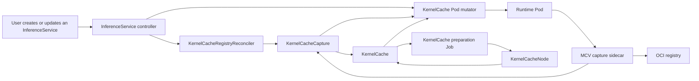
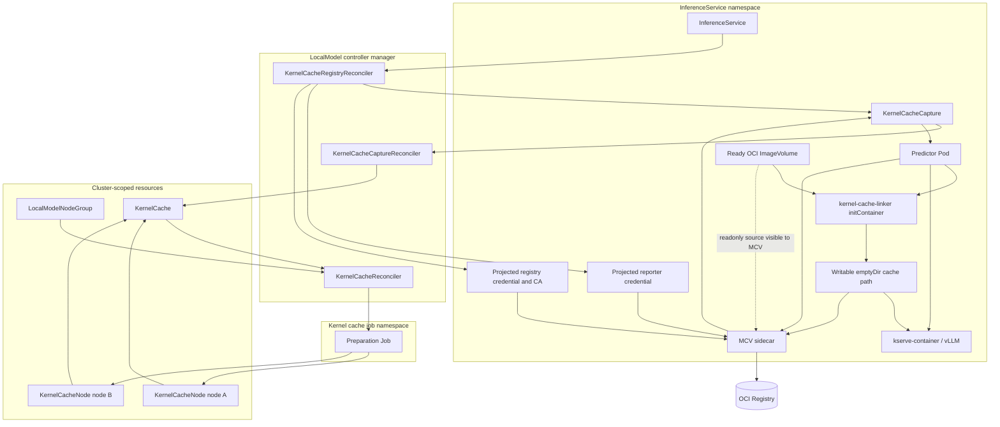
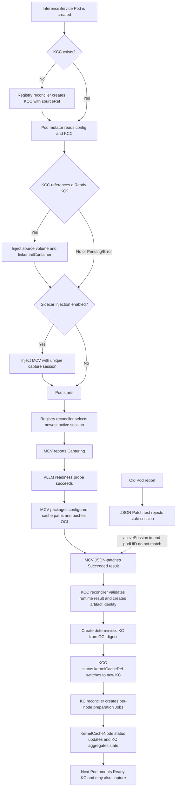
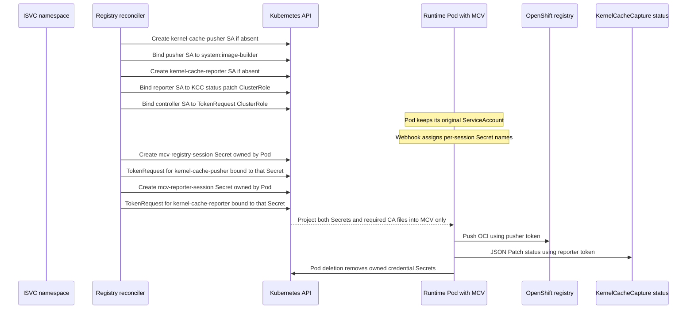

# Kernel Cache PoC: Current Architecture

This is a snapshot of the PoC as it works today. A capture packages the full configured cache path into one OCI artifact. Selecting a cache by footprint, ranking compatible caches, and creating delta-only artifacts are deliberately left for the next iteration.

## High-level architecture

The KCC follows the InferenceService because it records that workload's most recent capture. The KC is different: it is a reusable cache object, so it is not owned by the InferenceService and survives after the source workload is gone. When a later capture produces a different OCI digest, the KCC moves its reference to the new KC and leaves the old one alone. Retention and garbage collection will be added separately.

## Detailed component relationships

The webhook first looks for a Ready KC that the KCC already references. If it finds one, it adds a readonly OCI or PVC source and the `kernel-cache-linker` initContainer. The linker uses `cp -sr` to construct the runtime's writable `emptyDir` from that source. The runtime therefore sees its usual writable cache directory while existing files are links to the mounted cache.

MCV can run beside this setup. In that case it receives the same readonly source at `/var/run/gkm/kernel-cache`, which lets it read the existing linked files when it packages the next artifact. It only accepts absolute links that remain inside that mount; it cannot follow an arbitrary link from the runtime cache directory. Setting `serving.kserve.io/kernelcache-sidecar-injection: "false"` prevents MCV from being injected, but does not prevent an available KC from being mounted.

The preparation Job has a separate job: it prefetches the OCI source for `mountType: oci`, or extracts it into cache storage for `mountType: pvc`. Each node reports its result through KernelCacheNode, and KernelCache aggregates those results. The runtime Pod keeps its original ServiceAccount throughout; the MCV credentials shown below are projected into MCV only.

## Capture, publish, prepare, and reuse flow

Capture sessions matter when a Deployment replaces a Pod while its old MCV sidecar is still running. The registry reconciler chooses the newest eligible producer and writes its ID and Pod UID to `KCC.status.activeSession`. MCV sends both values with every result. Its status update is a JSON Patch that first checks those active-session values, then replaces `status.runtimeResult`.

That check makes a late report from the old Pod harmless: the patch fails and the old sidecar becomes idle. Once the current result is validated, the KCC creates a KC named from the OCI digest and switches `status.kernelCacheRef` to it. The old KC remains intact.

## Namespace-scoped credentials and short-lived tokens

The runtime Pod must keep the ServiceAccount chosen by the user or by KServe. Changing it to OpenShift's `builder` ServiceAccount would change the workload's permissions. Giving the runtime identity both registry-push and KCC-status write permission would have the same problem in a less visible form: an optional cache feature would expand the authority of the serving workload.

Kernel Cache avoids that by splitting the two MCV actions into dedicated identities:

| Sidecar action | Dedicated ServiceAccount | Granted permission | Token use |
| --- | --- | --- | --- |
| Push a captured OCI image to the OpenShift internal registry | `kernel-cache-pusher` | OpenShift `system:image-builder` in the ISVC namespace | A short-lived token is requested for this SA and bound to one generated registry credential Secret. |
| Patch one KCC runtime result | `kernel-cache-reporter` | `kserve-kernelcache-reporter`, limited to `kernelcachecaptures/status` | A short-lived token is requested for this SA and bound to one generated reporter credential Secret. |
| Request these tokens | Controller manager SA in the operator namespace | `kserve-kernelcache-token-requester` in each enabled ISVC namespace | The controller requests tokens; the runtime Pod does not. |

Both dedicated ServiceAccounts set `automountServiceAccountToken: false`. They are used only as the subject of a TokenRequest; neither becomes the runtime Pod's identity.

When the registry reconciler first handles an enabled Kernel Cache namespace, it ensures that the namespace has `kernel-cache-pusher` and `kernel-cache-reporter`. It also creates the three RoleBindings needed for the pusher, reporter, and controller manager. These are reusable namespace-level objects, so a later capture does not create another set.

The per-Pod part starts at admission. The webhook creates a capture-session UUID and names two future Secrets from it: `mcv-registry-<session>` and `mcv-reporter-<session>`. It adds optional Secret projections and the required CA projection to MCV. Optional is important here: the Pod must be admitted before the controller can see it and issue credentials for it.

Once the registry reconciler observes that live injected Pod, it first selects the active KCC session. It then creates the two Secrets with the Pod as their controller owner and requests a token for each dedicated ServiceAccount. The token is bound to its Secret object, so it cannot outlive or be moved away from that Secret. The default lifetime is 600 seconds. The OpenShift registry lifetime can be configured with `kernelcache.registry.auth.openshift.tokenTTLSeconds`.

MCV waits for the projections to become available. It uses the pusher token only to publish the OCI image and the reporter token only to JSON Patch the KCC status. Neither credential is logged or copied into CR status. When the Pod is deleted, Kubernetes garbage-collects the two Pod-owned Secrets. The reusable ServiceAccounts and RoleBindings remain for the next capture. If Kernel Cache is disabled, the reconciler removes only the namespace-level objects it labeled as managed.

With `registry.auth.type: none`, there is no registry Secret or registry token. MCV still needs the reporter credential because reporting capture progress and completion is independent of how the OCI registry authenticates.

## Cache selection

The Pod webhook calculates identity from the declared runtime image, model URI hash, TP, command, and args. Namespace and workload name are stored as factors but excluded from both footprints. A digest-pinned image is eligible for exact workload and compatibility matching. An explicit version tag is eligible only for exact compatibility matching. `latest` and implicitly-latest images are not selected automatically.

Only Ready KCs in the Pod namespace are considered. Workload footprint has priority over compatibility footprint. If neither matches, all factors are compared with equal weight and the highest candidate at or above 80 percent is selected. No factor is a hard rejection during scoring. The current KCC reference is used only as a deterministic preference among equal matches; a missing or stale reference does not block another KC match.

## Deferred behavior

- Delta-only OCI creation based on cache directory snapshots.
- Multi-Pod TP/PP capture coordination.
- KC garbage collection based on actual consumer usage and retention time.
