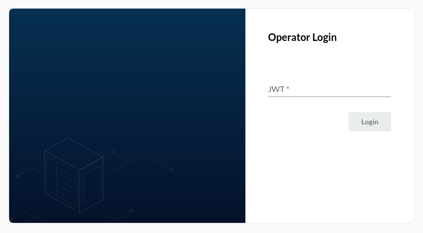
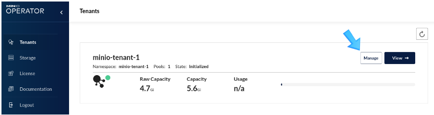
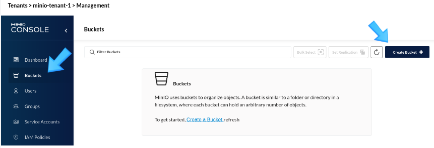
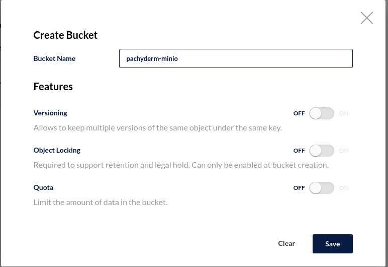
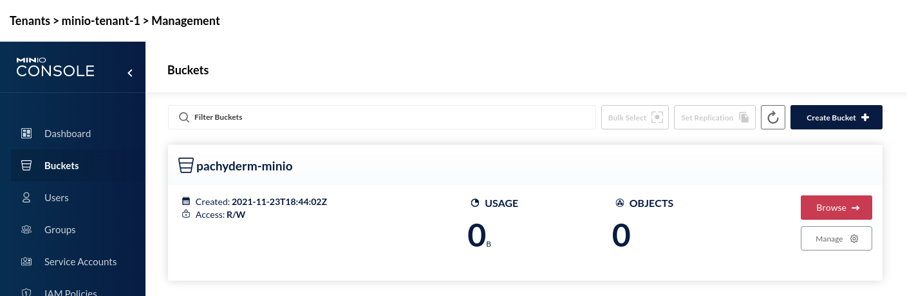

# Minio Deployment 

## History
- Updated 2021/Nov/23 
  - Tested with OSD 4.9
  - minio 4.0.2

## Manaual Install

- [Blog](https://blog.min.io/object_storage_as_a_service_on_minio/)
 
### Steps
 
 - Download [krew](https://krew.sigs.k8s.io/docs/user-guide/setup/install/)
    ~~~
    (
      set -x; cd "$(mktemp -d)" &&
      OS="$(uname | tr '[:upper:]' '[:lower:]')" &&
      ARCH="$(uname -m | sed -e 's/x86_64/amd64/' -e 's/\(arm\)\(64\)\?.*/\1\2/' -e 's/aarch64$/arm64/')" &&
      curl -fsSLO "https://github.com/kubernetes-sigs/krew/releases/latest/download/krew-linux_${ARCH}.tar.gz" &&
      tar zxvf krew-linux_${ARCH}.tar.gz &&
      KREW=./krew-"${OS}_${ARCH}" &&
      "$KREW" install krew
    )
    ~~~
  
 - Add the krew into .bashrc
    ~~~
    vi ~/.bashrc
    export PATH="${KREW_ROOT:-$HOME/.krew}/bin:$PATH"
    ~~~
  
 - Install kubernetes minio plugin
    ~~~
    oc krew install minio
    ~~~

 - Deploy minio operator/console
    ~~~
    oc minio init
    ~~~
 
 - Add anyuid scc to minio-operator/console sa
    ~~~   
    oc adm policy add-scc-to-user nonroot -z minio-operator -n minio-operator
    oc adm policy add-scc-to-user nonroot -z console -n minio-operator
    ~~~

 - Deploy Minio Tenant
    
    - Create a tenant namespace
      ~~~
      oc new-project minio-tenant-1  
      ~~~
      
    - Minio container image use `1000` as an user so default SA in the minio-tenant-1 namespace must be added to SCC "nonroot"
      ~~~
      oc patch scc/nonroot \
      -p='[{"op":"add", "path": "/users/-", "value": "system:serviceaccount:minio-tenant-1:default"}]' --type='json'
      
      or 
      
      oc adm policy add-scc-to-user nonroot -z default -n minio-tenant-1
      ~~~

    - Create a Minio Tenant
      ~~~
      oc minio tenant create minio-tenant-1 \
      --servers 2 --volumes 10 --capacity 5G \
      --namespace minio-tenant-1  \
      --storage-class gp2
      ~~~
    - Tenant information
      ~~~
        Username: admin 
        Password: e5e1b12b-97b5-4af3-aec6-6f14fc694dca 
        Note: Copy the credentials to a secure location. MinIO will not display these again.

      +-------------+------------------------+----------------+--------------+--------------+
      | APPLICATION | SERVICE NAME           | NAMESPACE      | SERVICE TYPE | SERVICE PORT |
      +-------------+------------------------+----------------+--------------+--------------+
      | MinIO       | minio                  | minio-tenant-1 | ClusterIP    | 443          |
      | Console     | minio-tenant-1-console | minio-tenant-1 | ClusterIP    | 9443         |
      +-------------+------------------------+----------------+--------------+--------------+
      wait for 3~4mins
      ~~~
  

    - Access Minio Operator
   
      - *Proxy Way*
        ~~~
        oc minio proxy
        ~~~
        
      - *Route Way*
        ~~~
        oc expose svc/console
        oc get route -n minio-operator
        ~~~

      

      - *Get JWT*
        `oc minio proxy` usually provide the JWT token but sometimes it failed to provide JWT with the following msg:
        ~~~
        Error: Couldn't determine JWT to connect to console
        ~~~
        Then, you can get the JWT token with the following command:
        ~~~
        oc -n minio-operator get secret $(kubectl -n minio-operator get serviceaccount console-sa -o jsonpath="{.secrets[1].name}") -o jsonpath="{.data.token}" | base64 --decode
        ~~~          

  
  - Create a bucket from Minio Console of the tenant
    ~~~
    bucket name:  pachyderm-minio
    ~~~
       

 - Access Minio tenant
   - Get accesskey/secretkey
      ~~~
      oc get secret minio-tenant-1-creds-secret 
      ~~~

      ~~~
      accesskey:  4df90cb2-5857-453b-8a59-e80e12fa1067
      oc get secret minio-tenant-1-creds-secret -n minio-tenant-1 -o jsonpath='{ .data.accesskey}'|base64 -d

      secretkey 0a6da0b9-5d7b-4a8c-af1c-eb768a66588a
      oc get secret minio-tenant-1-creds-secret -n minio-tenant-1 -o jsonpath='{ .data.secretkey}'|base64 -d
      ~~~
