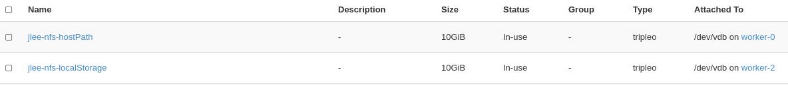

# Deploy Local Storage Operator

## Steps
- Attach disk to the node that NFS server will be running
  - In this tutorial, 
    - we will use worker-2 for localstorage
    - we will use worker-0 for hostPath (optional)
      - Or, you can create a folder for hostPath just for testing.

- Example steps
  ~~~
  oc debug node/${NODE}
  Starting pod/ip-10-0-129-66us-east-2computeinternal-debug ...
  To use host binaries, run `chroot /host`
  Pod IP: 10.0.129.66
  If you don't see a command prompt, try pressing enter.
  sh-4.2# chroot /host
  sh-4.4# ls
  bin  boot  dev	etc  home  lib	lib64  media  mnt  opt	ostree	proc  root  run  sbin  srv  sys  sysroot  tmp  usr  var
  sh-4.4# lsblk
  NAME                         MAJ:MIN RM   SIZE RO TYPE MOUNTPOINT
  xvda                         202:0    0   120G  0 disk 
  |-xvda1                      202:1    0   384M  0 part /boot
  |-xvda2                      202:2    0   127M  0 part /boot/efi
  |-xvda3                      202:3    0     1M  0 part 
  `-xvda4                      202:4    0 119.5G  0 part 
    `-coreos-luks-root-nocrypt 253:0    0 119.5G  0 dm   /sysroot
  xvdf                         202:80   0     1G  0 disk         <======  
  ~~~

### Local Storage 
[Offical Doc](https://docs.openshift.com/container-platform/4.5/storage/persistent_storage/persistent-storage-local.html#local-storage-install_persistent-storage-local)

~~~

export productVersion=4.5
export targetNode=worker-2.bell.tamlab.brq.redhat.com     (Note: in AWS, the hostname should be some like `ip-10-0-129-66` Not hostname)
export devPath=/dev/vdb

echo "
apiVersion: v1
kind: Namespace
metadata:
  name: local-storage
---
apiVersion: operators.coreos.com/v1alpha2
kind: OperatorGroup
metadata:
  name: local-operator-group
  namespace: local-storage
spec:
  targetNamespaces:
    - local-storage
---
apiVersion: operators.coreos.com/v1alpha1
kind: Subscription
metadata:
  name: local-storage-operator
  namespace: local-storage
spec:
  channel: \"${productVersion}\" 
  installPlanApproval: Automatic
  name: local-storage-operator
  source: redhat-operators
  sourceNamespace: openshift-marketplace" |oc create -f -

oc project local-storage

echo "
apiVersion: \"local.storage.openshift.io/v1\"
kind: "LocalVolume"
metadata:
  name: \"local-disks\"
  namespace: \"local-storage\" 
spec:
  nodeSelector: 
    nodeSelectorTerms:
    - matchExpressions:
        - key: kubernetes.io/hostname
          operator: In
          values:
          - \"${targetNode}\"
  storageClassDevices:
    - storageClassName: \"local-sc\"
      volumeMode: Filesystem 
      fsType: xfs 
      devicePaths: 
        - \"${devPath}\"" | oc create -f -
  
~~~

### HostPath

- Get in the node
  ~~~
  export targeNode=worker-0.bell.tamlab.brq.redhat.com
  oc label node ${targetNode} app=nfs-provisioner
  oc debug node/${targetNode} 
  ~~~

- Create a folder and set selinux context for the folder
  ~~~
  chroot /host

  mkdir /home/core/nfs

  chcon -Rvt svirt_sandbox_file_t /home/core/nfs

  exit
  exit
  ~~~

