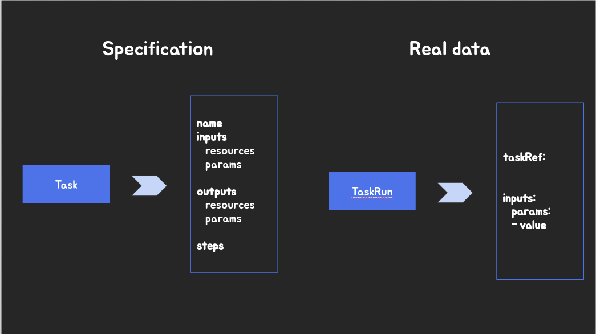
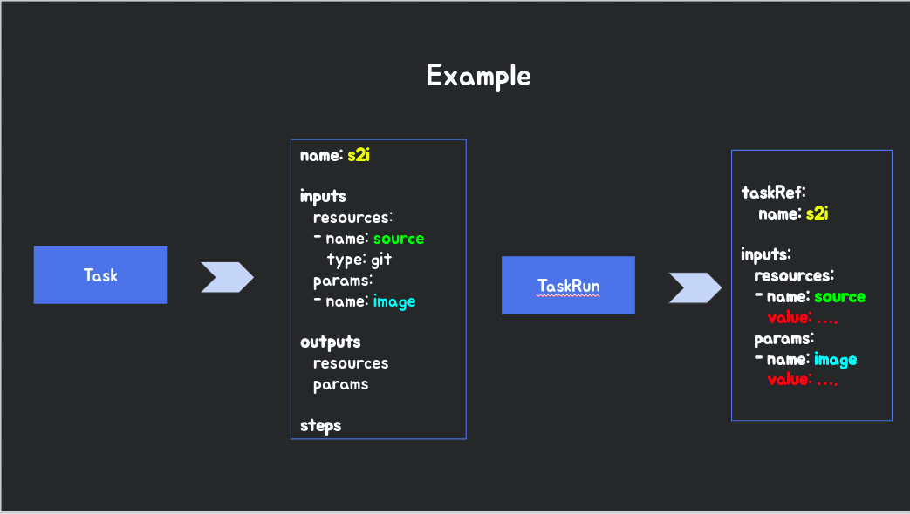
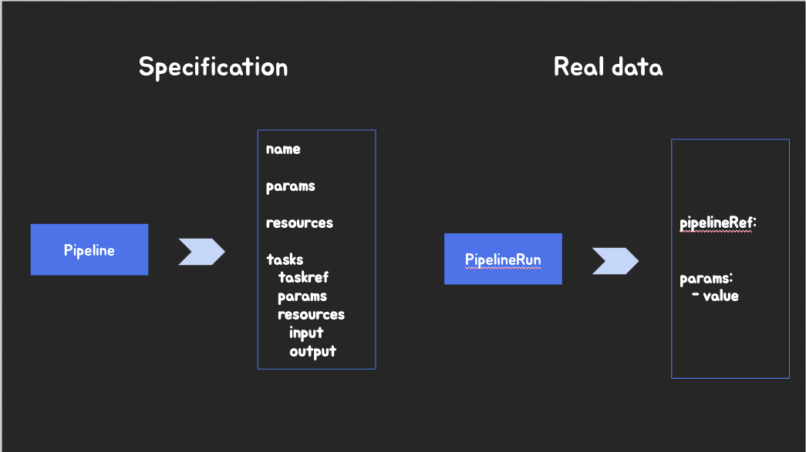
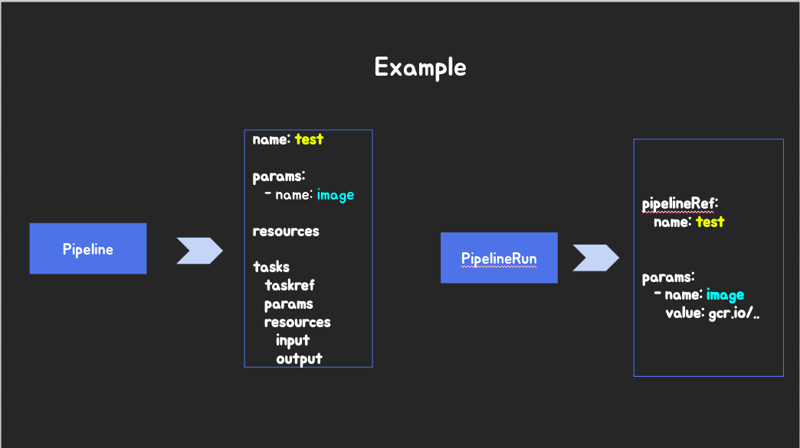
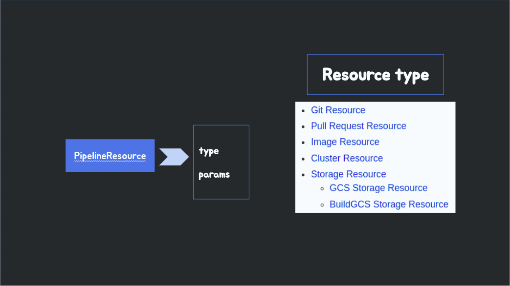

Understanding Tekton CRDS
--------------------------

[Ordering](https://github.com/tektoncd/pipeline/blob/master/docs/pipelines.md#ordering)

- Real data can be given by
  - PipelineRun params
  - TaskRun params
  - PipelineResource
